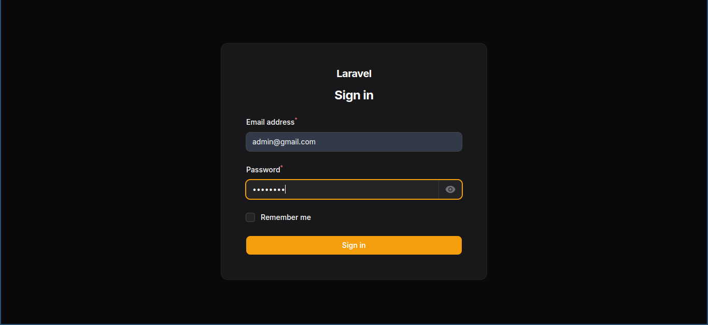
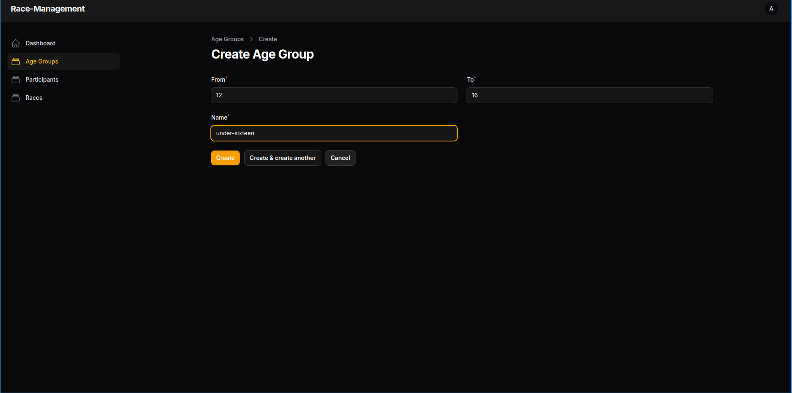
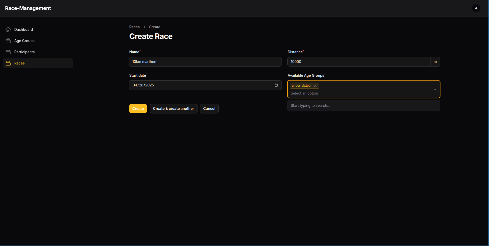
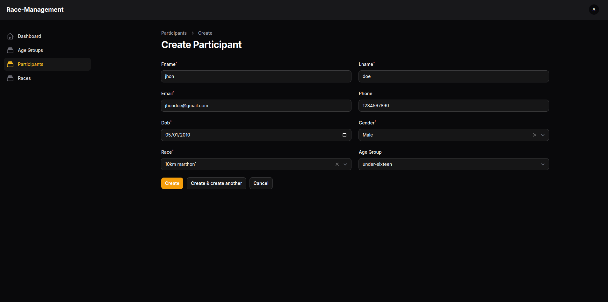
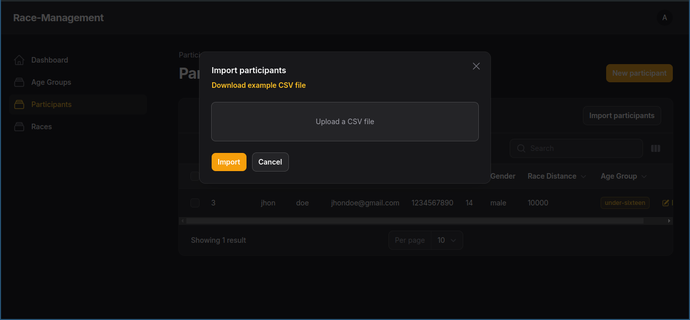

# Participant Management for Race

## Overview

This Laravel application implements a Participant Management for a Race/Marathon, featuring full CRUD operations and CSV bulk import functionality. The admin interface is built using Filament PHP.

## Why Filament?

-   **Rapid Development**: Ready-made components for CRUD operations
-   **Built-in Features**: Form validation, notifications, and responsive design
-   **Modern UX**: Polished admin interface
-   **Time Efficiency**: Allows to give more time on core logic

## Features

✅ Complete Participant CRUD operations  
✅ Bulk import from CSV  
✅ Paginated listing with filters  
✅ Form validation (unique bib numbers/chip codes)  
✅ Success/error notifications  
✅ Age calculation from DOB

## Requirements

-   PHP >=8.4
-   Composer
-   MySql

## Installation

clone this repo

```
git clone https://github.com/surajpahari/race-mgn.git
```

install packages with composer and set env

```bash
composer install
cp .env.example .env
```

configure database(mysql recommended) in .env

```bash
php artisan key:generate
php artisan migrate
```

create the filament user with:

```bash
php artisan make:filament-user
```

fill up the credentials

### Development

Start the development server with:

```bash
php artisan serve
```

Your application will be available at `http://localhost:8000`.

## Login using filament credentials



## Create the age-group



## Create race and mention the available age-group



## Create Participant to participate in race



## Bulk add CSV

use this sample csv(need hard coded id for relationship) for testing [Download File](https://github.com/username/repository/raw/branch/path/to/file)


